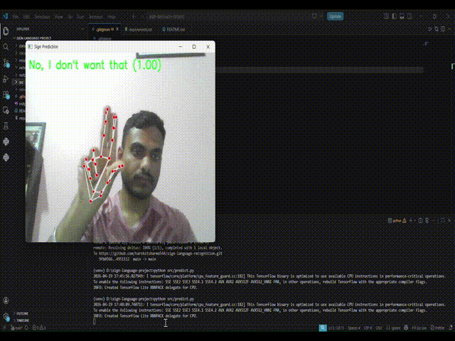

# Real-Time Sign Language Recognition System

## 📌 Overview

This project is a real-time sign language recognition system that converts hand gestures into meaningful text and speech using computer vision and deep learning.

## 🚀 Features

* Real-time hand gesture detection using webcam
* Sign language recognition using deep learning
* Sentence generation from predicted signs
* Audio output using text-to-speech
* Multimodal system (Video → Text + Speech)

## 🧠 Technologies Used

* Python
* OpenCV
* MediaPipe
* TensorFlow / Keras
* pyttsx3

## 📂 Project Structure

```
src/                # Source code  
models/             # Trained model  
data/               # Sample dataset  
```

## ▶️ How to Run

1. Install dependencies:

```
pip install -r requirements.txt
```

2. Run prediction:

```
python src/predict.py
```

## 🎬 Demo



## 🎯 Use Case

Helps speech- and hearing-impaired individuals communicate effectively.

## 📌 Future Improvements

* Add more gestures
* Improve accuracy with larger dataset
* Use advanced models (CNN/LSTM)
* Deploy as web/mobile application

---

> Note: Large processed datasets are excluded due to size constraints.

⭐ If you like this project, give it a star!
